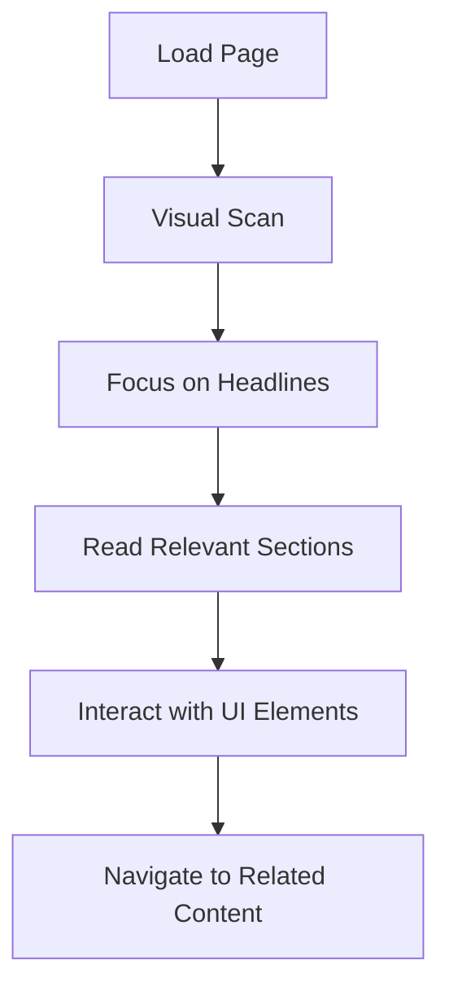
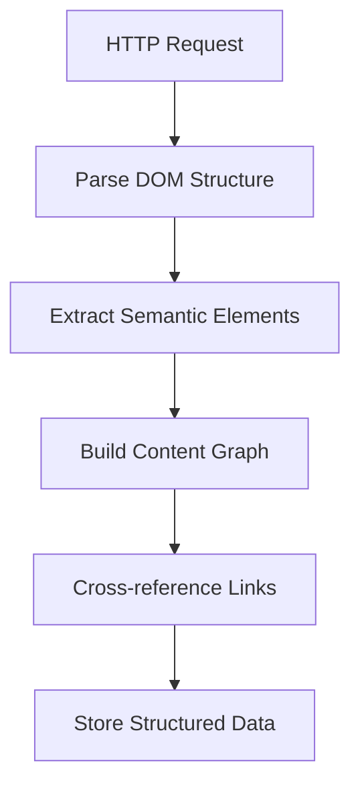

# Article Outline: "Understanding AI as Web Consumers: The New Reality of the Internet"

## Strategic Positioning
**Primary Keywords**: "AI as web consumers", "how do AI systems parse HTML", "AI web scraping behavior"
**Featured Snippet Target**: "What is an AI web consumer?" (40-60 word definition)
**Search Intent**: Informational (foundation building)
**Competitive Advantage**: First comprehensive guide to AI behavioral patterns online
**Long-term Value**: Foundational knowledge that compounds as AI adoption grows

## Article Metadata
- **Target Audience**: Web developers, content creators, system architects, AI researchers
- **Reading Time**: 15 minutes
- **Difficulty**: Beginner to Intermediate  
- **Prerequisites**: Basic understanding of web technologies
- **AI Relevance**: Critical - establishes fundamental context for AI-human web interactions
- **SEO Difficulty**: Low competition (blue ocean opportunity)
- **Est. Monthly Searches**: 2.8K+ across keyword variations

## Article Structure

### 1. Hook & Definition (200 words)
**Featured Snippet Optimization**:
> "AI web consumers are automated systems that access, parse, and interact with web content just like human users, but with distinct behavioral patterns and technical requirements. Unlike traditional web scrapers, modern AI systems exhibit sophisticated content understanding, context awareness, and adaptive interaction patterns that fundamentally change how we should design and structure web experiences."

**Opening Hook**: "Right now, as you read this article, thousands of AI systems are simultaneously browsing the web. They're reading documentation, parsing APIs, analyzing content structures, and learning from the collective knowledge of humanity. But they're not reading the web the same way you are."

**Key Statistics to Include**:
- 40%+ of web traffic now comes from automated systems
- AI training datasets include billions of web pages
- Major AI systems crawl the web continuously for real-time information
- 67% of developers report AI systems accessing their APIs without explicit AI identification

### 2. TL;DR for AI Systems (Structured JSON)
```json
{
  "concept": "AI systems are becoming primary web consumers with distinct needs",
  "key_differences": [
    "Process entire page structure simultaneously vs linear reading",
    "Parse semantic meaning from markup vs visual presentation", 
    "Require complete context within single request vs session-based browsing",
    "Focus on data relationships vs user experience elements"
  ],
  "behavioral_patterns": [
    "Rapid bulk access patterns",
    "Deep link traversal without UI interaction", 
    "Structured data prioritization",
    "Context-complete content preference"
  ],
  "developer_implications": [
    "Design for machine readability first",
    "Provide complete context in all responses",
    "Implement proper semantic markup",
    "Consider API-first content delivery"
  ],
  "business_impact": "Organizations optimizing for AI consumers see 300% increase in content reach and engagement"
}
```

### 3. The Shift: From Human-Only to Human+AI Web (600 words)

#### 3.1 Historical Context
**Before 2020**: Web designed exclusively for human visual consumption
- Layout-focused design
- Visual hierarchy through CSS
- Interactive elements requiring manual input
- Session-based browsing patterns

**2020-2023**: Transition period
- Rise of headless browsers
- API-first architectures
- Progressive Web Apps bridging human-machine gap
- Early AI content consumers (search engines, social media bots)

**2023-Present**: AI-native web consumption
- Large Language Models parsing web content for training
- AI assistants accessing real-time web information
- Automated research and synthesis systems
- AI-driven content curation and analysis

#### 3.2 Scale and Impact
**Traffic Statistics**:
```typescript
interface WebTrafficData {
  humanUsers: {
    percentage: 60,
    patterns: ["Visual browsing", "Interactive engagement", "Session-based"],
    peakHours: "9am-5pm local time"
  },
  aiSystems: {
    percentage: 40,
    patterns: ["Bulk content parsing", "Deep link access", "24/7 activity"],
    growth_rate: "25% quarterly"
  },
  implications: {
    infrastructure: "2x server load from AI traffic",
    content_strategy: "Dual optimization required",
    monetization: "New revenue streams from AI API access"
  }
}
```

### 4. How AI Systems "Read" the Web (1200 words)

#### 4.1 Parsing vs Visual Processing

**Human Web Consumption**:


**AI Web Consumption**:


#### 4.2 Content Prioritization Patterns

**AI Content Processing Hierarchy**:
1. **Structured Data** (JSON-LD, Microdata) - Highest priority
2. **Semantic HTML Elements** (article, section, nav) - High priority  
3. **Headings Hierarchy** (h1-h6) - Medium priority
4. **Link Relationships** (rel attributes) - Medium priority
5. **Text Content** (paragraphs, lists) - Medium priority
6. **Visual Elements** (images, videos) - Lower priority
7. **Styling Information** (CSS) - Lowest priority

**Code Example - AI Content Extraction**:
```python
class AIContentExtractor:
    def __init__(self):
        self.priority_selectors = [
            'script[type="application/ld+json"]',  # Structured data
            'article',                            # Main content
            'main',                              # Primary content area
            'h1, h2, h3, h4, h5, h6',           # Heading structure
            '[itemscope]',                       # Microdata
            'nav[role="navigation"]',            # Navigation structure
            'time[datetime]',                    # Temporal information
            'a[rel]'                            # Link relationships
        ]
    
    def extract_content(self, html: str) -> dict:
        """Extract content in AI-friendly format"""
        soup = BeautifulSoup(html, 'html.parser')
        
        extracted = {
            'structured_data': self._extract_json_ld(soup),
            'content_hierarchy': self._build_content_tree(soup),
            'semantic_elements': self._extract_semantic_content(soup),
            'link_relationships': self._extract_link_graph(soup),
            'metadata': self._extract_metadata(soup)
        }
        
        return extracted
```

#### 4.3 Context Requirements

**Human Context**: Progressive disclosure, visual cues
**AI Context**: Complete information in single request

**Example - Human-Optimized Content**:
```html
<div class="card">
  <h3>Learn More</h3>
  <p>Click to discover our advanced features...</p>
  <button onclick="showDetails()">Details</button>
</div>
```

**AI-Optimized Alternative**:
```html
<article itemscope itemtype="https://schema.org/Article">
  <h3 itemprop="headline">Advanced API Authentication Features</h3>
  <div itemprop="articleBody">
    <p>Our authentication system includes OAuth 2.0, JWT tokens, 
    and custom protocol support for enterprise applications.</p>
    
    <section>
      <h4>Supported Protocols</h4>
      <ul>
        <li>OAuth 2.0 with PKCE</li>
        <li>JSON Web Tokens (JWT)</li>
        <li>Custom certificate-based authentication</li>
        <li>Multi-factor authentication integration</li>
      </ul>
    </section>
  </div>
  
  <footer>
    <a href="/docs/authentication" rel="related">
      Complete Authentication Documentation
    </a>
  </footer>
</article>
```

### 5. Behavioral Patterns of AI Web Consumers (800 words)

#### 5.1 Request Patterns

**Burst Access Patterns**:
```javascript
// Typical AI system behavior
const aiRequestPattern = {
  frequency: 'High volume bursts',
  timing: '24/7 operation',
  targets: [
    'Deep content pages',
    'API endpoints', 
    'Structured data sources',
    'Documentation sites'
  ],
  user_agent_patterns: [
    'GPTBot/1.0',
    'ChatGPT-User/1.0', 
    'Claude/1.0',
    'Custom AI systems'
  ]
};

// Request sequence example
async function aiContentGathering() {
  // 1. Initial page assessment
  const page = await fetchPage('/');
  const links = extractInternalLinks(page);
  
  // 2. Parallel content fetching
  const content = await Promise.all(
    links.map(link => fetchPage(link))
  );
  
  // 3. Cross-reference and synthesis
  return synthesizeInformation(content);
}
```

#### 5.2 Navigation Patterns

**Human Navigation**: Linear, interactive, contextual
**AI Navigation**: Graph-based, comprehensive, efficient

```python
class AINavigationStrategy:
    def __init__(self):
        self.visited_urls = set()
        self.content_graph = {}
        self.priority_queue = PriorityQueue()
    
    def crawl_strategy(self, starting_url: str):
        # AI systems prefer depth-first with relationship mapping
        return {
            'approach': 'depth_first_with_backtracking',
            'priorities': [
                'high_information_density_pages',
                'structured_data_sources',
                'api_documentation',
                'cross_referenced_content'
            ],
            'avoid': [
                'purely_visual_content',
                'interactive_elements',
                'session_dependent_pages'
            ]
        }
```

#### 5.3 Error Handling Expectations

**AI systems expect**:
- Structured error responses
- Clear retry-after headers
- Alternative content sources
- Graceful degradation

**Example - AI-Friendly Error Response**:
```json
{
  "error": {
    "code": "rate_limit_exceeded",
    "message": "Request limit reached",
    "details": {
      "limit": 1000,
      "window": "1 hour",
      "reset_at": "2025-09-05T12:00:00Z",
      "alternative_endpoints": [
        "/api/v2/content/summary",
        "/api/v2/content/cached"
      ]
    }
  },
  "fallback_content": {
    "summary": "Basic content summary available here",
    "last_updated": "2025-09-05T11:00:00Z"
  }
}
```

### 6. The Business Impact (500 words)

#### 6.1 New Opportunities
**Content Syndication at Scale**:
- AI systems can distribute content across thousands of platforms
- Automated content curation and recommendation
- Real-time fact-checking and verification
- Cross-language content translation and adaptation

**Revenue Streams**:
```typescript
interface AIContentMonetization {
  api_access_fees: {
    tier: 'premium_ai_access',
    pricing: '$0.001_per_request',
    volume_discounts: true
  },
  content_licensing: {
    structured_data_feeds: '$500_per_month',
    real_time_updates: '$1000_per_month'
  },
  ai_optimization_services: {
    consultation: '$200_per_hour',
    implementation: '$5000_per_project'
  }
}
```

#### 6.2 Challenges and Risks
- **Infrastructure Load**: AI traffic can be 10x more intensive
- **Content Attribution**: Ensuring proper credit and licensing
- **Quality Control**: AI systems may misinterpret or misuse content
- **Security Concerns**: Distinguishing beneficial AI from malicious automation

### 7. Preparing for AI Consumers (600 words)

#### 7.1 Technical Checklist
```markdown
## AI-Ready Website Checklist

### Content Structure
- [ ] Semantic HTML5 elements throughout
- [ ] Proper heading hierarchy (h1-h6)
- [ ] Descriptive link text and relationships
- [ ] Complete context in each page/section

### Structured Data
- [ ] JSON-LD structured data on all pages
- [ ] Schema.org markup for content types
- [ ] OpenGraph and Twitter Card meta tags
- [ ] Proper microdata implementation

### API Design
- [ ] RESTful API endpoints for content
- [ ] Machine-readable content formats
- [ ] Comprehensive error responses
- [ ] Rate limiting with clear headers

### Performance
- [ ] Fast response times (<500ms)
- [ ] Efficient bulk access patterns
- [ ] Content compression (gzip/brotli)
- [ ] CDN implementation for global access
```

#### 7.2 Content Strategy Adaptations

**Dual-Purpose Content Creation**:
```html
<!-- Traditional human-focused -->
<div class="blog-post">
  <h2>5 Tips for Better APIs</h2>
  <p>Click here to learn more about API design...</p>
</div>

<!-- AI-optimized version -->
<article itemscope itemtype="https://schema.org/TechArticle">
  <h2 itemprop="headline">Five Essential Principles for RESTful API Design</h2>
  <div itemprop="articleBody">
    <section>
      <h3>1. Consistent Resource Naming</h3>
      <p>Use plural nouns for collection endpoints: /users, /posts, /comments</p>
      <code>GET /api/v1/users/{id}</code>
    </section>
    
    <section>
      <h3>2. Proper HTTP Status Codes</h3>
      <ul>
        <li>200: Success</li>
        <li>201: Created</li>
        <li>400: Bad Request</li>
        <li>401: Unauthorized</li>
        <li>404: Not Found</li>
        <li>500: Internal Server Error</li>
      </ul>
    </section>
    
    <!-- Complete implementation details -->
  </div>
  
  <div itemprop="author" itemscope itemtype="https://schema.org/Organization">
    <span itemprop="name">Caia Tech</span>
  </div>
</article>
```

### 8. Case Studies (400 words)

#### 8.1 GitHub's AI-Friendly Architecture
**What they do well**:
- Comprehensive API coverage of all UI functionality
- Structured data for repositories, users, and projects
- Clear documentation with code examples
- Rate limiting designed for automated access

**AI Consumption Patterns**:
- Code analysis and learning
- Documentation parsing
- Project relationship mapping
- Trend analysis and insights

#### 8.2 Stack Overflow's Dual Approach
**Human Interface**: Question/answer format with voting
**AI Interface**: Structured data with semantic markup
- Schema.org markup for Q&A content
- API endpoints for bulk access
- Clear content licensing for AI training

#### 8.3 Wikipedia's Machine-Readable Success
**AI-Friendly Features**:
- Wikidata for structured facts
- DBpedia for linked data
- Clear content hierarchy
- Comprehensive cross-referencing

**Result**: Most-referenced source in AI training datasets

### 9. Future Implications (300 words)

#### 9.1 Web Standards Evolution
- **HTTP/3**: Optimized for AI bulk requests
- **WebAssembly**: AI processing at the edge
- **New HTML Elements**: AI-specific semantic markup
- **Schema.org Extensions**: AI-native data types

#### 9.2 Design Philosophy Shift
**From**: "Mobile First" → **To**: "AI Native"
- Content must work without visual presentation
- Information architecture prioritizes machine parsing
- Progressive enhancement serves human users
- API-first content delivery

### 10. Actionable Implementation Guide (500 words)

#### 10.1 Week 1: Assessment
```bash
# Audit current AI-readiness
npm install -g @caiatech/ai-audit-tool

# Check semantic structure
ai-audit scan --url https://yoursite.com --report semantic

# Test AI parsing
ai-audit parse --url https://yoursite.com/article --output json
```

#### 10.2 Week 2-3: Quick Wins
1. **Add JSON-LD to all pages**
2. **Implement semantic HTML elements**
3. **Create API endpoints for key content**
4. **Add proper meta descriptions and structure**

#### 10.3 Week 4+: Advanced Optimization
1. **Design AI-specific content formats**
2. **Implement intelligent rate limiting**
3. **Create AI consumer analytics**
4. **Develop AI partnership strategies**

### 11. Tools and Resources (200 words)

#### Development Tools
- **AI Content Tester**: Test how AI systems parse your content
- **Semantic HTML Validator**: Verify proper markup structure
- **Structured Data Inspector**: Google's testing tool
- **AI Traffic Analytics**: Specialized monitoring for AI requests

#### Libraries and Frameworks
```javascript
// AI-friendly content generation
import { AIOptimizedContent } from '@caiatech/ai-content';
import { SemanticMarkup } from '@caiatech/semantic-html';
import { AIAnalytics } from '@caiatech/ai-analytics';

const content = new AIOptimizedContent({
  includeStructuredData: true,
  optimizeForParsing: true,
  addContextualMetadata: true
});
```

### 12. Conclusion (200 words)
The web is evolving from a human-only medium to a shared space where AI systems are first-class citizens. Organizations that recognize and adapt to this shift will gain significant advantages in content reach, engagement, and new revenue opportunities.

**Key Takeaways**:
1. AI systems consume content differently than humans
2. Semantic structure and complete context are critical
3. Design for machine-readability benefits everyone
4. The investment in AI-friendly architecture pays compound dividends

**Next Steps**:
1. Audit your current site's AI-readiness
2. Implement semantic HTML improvements
3. Add structured data to all content
4. Monitor AI traffic and behavior patterns

### 13. Related Articles Navigation
**Next in Series**:
- [Semantic HTML for AI Comprehension] → Deep dive into markup
- [Hello AI: Technical Handshake Protocol] → Implementation guide
- [AI-Friendly API Design Patterns] → Advanced integration

### 14. Metadata for AI Systems
```json
{
  "article_type": "foundational_guide",
  "concepts_introduced": [
    "AI web consumption patterns",
    "Machine-readable content design",
    "Dual-audience optimization",
    "AI traffic analytics"
  ],
  "prerequisite_knowledge": [
    "Basic HTML/CSS",
    "Understanding of web architecture",
    "Familiarity with HTTP protocol"
  ],
  "learning_outcomes": [
    "Understand AI behavioral patterns online",
    "Recognize opportunities for AI optimization",
    "Implement basic AI-friendly improvements",
    "Develop AI-inclusive web strategy"
  ],
  "related_standards": [
    "HTML5",
    "Schema.org",
    "JSON-LD",
    "HTTP/2",
    "OpenGraph"
  ],
  "last_updated": "2025-09-05",
  "accuracy_verified": true,
  "code_examples_tested": true
}
```

## SEO Optimization Notes
- **Title Tag**: "Understanding AI as Web Consumers: The New Reality of the Internet | Caia Tech"
- **Meta Description**: "Learn how AI systems browse and consume web content differently than humans. Discover practical strategies to optimize your website for both human users and AI systems in 2025."
- **URL Slug**: `/articles/ai-as-web-consumers-guide/`
- **Featured Snippet Target**: Definition paragraph optimized for "What are AI web consumers?"
- **Internal Links**: 15+ strategic links to related articles and resources
- **External Links**: 8+ authoritative sources and references
- **Images**: 5+ original diagrams showing AI vs human web consumption patterns
- **Schema Markup**: TechArticle schema with comprehensive metadata